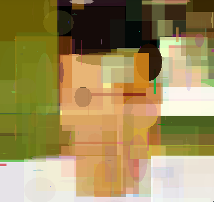
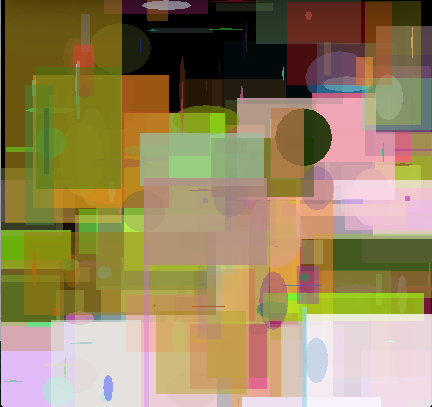

遺伝的アルゴリズムで画像を生成 
============

このプログラムは遺伝的アルゴリズムの二種類を使用していて、画像を進化させる。

### アルゴリズム

目標画像を表すための必要なデータが保存してある人口遺伝子を生成した。この遺伝子はポリゴン（多角形）の字列である。可能なポリゴンは三角、四角、長四角、円、楕円、n-辺形である。加えて、各ポリゴンは色、位置（xyz軸）、透明度、大きさも含められている。

図１

| 遺伝子の暗号化 | 説 |
|--------------|---|
|色体１ | |
| 3 | 三角(ポリゴンの種類) |
| (1.0,1.0) | 点A (x,y) | |
| (2.0,1.0) | 点B (x,y) |
| (1.5,2.0) | 点C (x,y) |
| 10 | z軸 |
| (0.5,0.0,0.0) | RGB値(赤・緑・青) |
| 0.5 | 透明度(５０％) |
| 染色体２ | |
| 4 | 長四角(ポリゴンの種類) |
| (3.0,4.0) | 点A (x,y) |
| 5.0 | 長さ |
| 16.0 | 高さ |
| 4 | z軸 |
| (0.5,0.6,1.0) | RGB値(赤・緑・青) |
| 0.0 | 透明度(０％) |
| など | |
 
遺伝子はプログラミングで数字列で現れている為、数字列とも呼ばれている。解と個体ということもある。上記の遺伝子は数字列に暗号化すると[3.0, 1.0, 1.0, 2.0, 1.0, 1.5, 2.0, 10.0, 0.5, 0.0, 0.0, 0.5, 4.0, 3.0, 4.0, 5.0, 16.0, 4.0, 0.5, 0.6, 1.0, 0.0] になる。
 
生物と同じように、遺伝的アルゴリズムにも遺伝子型と表現型がある。図１のポリゴン字列は遺伝子型で、そのポリゴンのデータをそれぞれ用いて画像を描き、最後に出てくる画像が表現型である。 表現型の画像 は目標画像と比較することで遺伝子の適応度が分かる。目標画像と近づいたら、誤差がほぼゼロと等しいと言っていい。画像の適応度を計算する関数は適応関数と呼ばれている。誤差関数と評価関数とも呼ばれる。

#### 無性生殖の遺伝的アルゴリズム ([SingleParentGeneticDraw.kt](https://github.com/kennycason/genetic_draw/blob/master/src/main/java/com/kennycason/genetic/draw/SingleParentGeneticDraw.kt))

1. 一個の個体をランダムに生成する。これを現世代と呼ぶ。
2. ある確率で現世代の遺伝子に突然変異を行い、次世代を生成する。
3. 目標画像を比較することで、次世代の適応度を計算する。　
4. もし次世代の画像が現世代の画像よりも目標画像に似ていたら、次世代の遺伝子を採用し、次世代の個体は現世代になる。次世代の個体は生き残る。
5. 2から繰り返す。

#### 有性生殖の遺伝的アルゴリズム ([PopulationBasedGeneticDraw.kt](https://github.com/kennycason/genetic_draw/blob/master/src/main/java/com/kennycason/genetic/draw/PopulationBasedGeneticDraw.kt))

1. 現世代に n個の個体をランダムに生成する。
2. 適応関数により、現世代の各個体の適応度をそれぞれ計算する。
3. 選択関数により、生殖する個体を選ぶ。
   a. エリート主義 ：最も良い個体をいくつ選びそのまま次世代に残す。
   b. ルーレット選択：他よりも適応度が高い個体の選ばれる確率が高くなる。
   c. その他、ランキング方式、ランダム方式など選択方法もあるが、このプログラムではルーレット選択とエリート主義を使用した。
4. 上記で選んだ個体の中から二つ選択して生殖させる。ある確率で交差と突然変異を行い、n-個の次世代に残す個体を生成する。
5. 2から繰り返す。

### 特別な結果と統計

進化させたフシギダネの画像で、エリート主義とルーレット選択を使用した。

　

黄色い四角の進化を表すGIF。

 

データランク社とシンプリーメジャード社のロゴの進化を表すGIF。

 

以下に遺伝子の暗号化によってマリオの画像の進化が分かる。左は ポリゴン字列を使用し、中と右はピクセル字列を使用した。

  

ヨッシーの進化の収束率が窺える。

透明なポリゴンを使用するとプログラムが７倍ぐらい遅くなるが、進化させた画像の適応度がもっと高くなり目標画像にもっと近くなる。以下の画像を見ることで透明度の重要性がわかる。左と中はそれぞれ２５００個と２０００個の透明なポリゴンを使用した。右は不透明なポリゴンを使用しているが、透明度の重要性が明らかであろう。

  

インターネットで他に似ているプロジェクトを検索したら、モナ・リザの名画を進化 させるプロジェクトをいくつか見つけた 。殆どの例は三角の字列を使用したが、私の実験では多くのポリゴンの種類を使う方法が最適であった。左と中は長四角と楕円の染色体を使用した。左は１０００個のポリゴンで、中は２０００個のポリゴンを使用した。右は三角だけ暗号化されている遺伝子を使用してあり、左と中の画像のように綺麗に進化できなかった。

  

以下の図で突然変異の確率はどのように学習率に影響するか、ということが分かる。予算した通り１０％は１％と５０％より収束率が高かった。１％の突然変異確率は収束する可能性が高いが、収束率が非常に遅い時もある。５０％の場合は突然変異が起こり過ぎるので次世代の個体群が不適応になってしまう恐れがある。突然変異の確率が低い場合は、収束になる時が多いが、局所最適解に陥ってしまって大域的最適解を見つけられない時もある。局所最適解から離れて大域的最適解を見つける為には、大きな変化を必要とするので、突然変異の確率が低過ぎると大きな変化はできない。また、大きな変化を行なっても検索空間が膨大すぎて、適応な個体になる可能性が低い。

この最適解を見つける戦略がいくつかあるが、このプログラムでは突然変異の確率をランダムに変える戦略を使用した。以下の図で変数と定数の突然変異の確率を比較し、ランダムに更新する方法が最適だと分かる。

カービーの画像の進化で、ピクセルとポリゴンの遺伝子が両方窺える。

  

しかし、右のカービーがなぜかうまく進化できなかった。今までの画像は問題なく進化させることができたので、進化できない画像を初めて発見し、とても驚いた。よく分析したら、問題は適応関数であった。詳しく説明すると、このアルゴリズムの適応関数は直接各ピクセルのRGB値を比較し、赤・緑・青の値はそれぞれ数字に暗号化されているので赤の値の方が緑と青より高い。

赤＝1111 1111 0000 0000 0000 0000 
緑＝0000 0000 1111 1111 0000 0000 
青＝0000 0000 0000 0000 1111 1111 

すなわち、赤を変化すると適応関数によって差が大きくて、青を変化するより不適応になってしまう。適応関数には問題があったせいで赤の多い画像が進化しにくくなる。この問題を解決するため、RGB値を一つの数字から三つの数字（赤・緑・青）に分けて比較する。

この実験の詳細な統計と図が以下のエクセルファイルで見ることができる。[ここへクリック](convergence_stats.xlsx?raw=true).

最後に、これは私のプロフィールの画像の進化である。：）

進化中の画像

 
 
